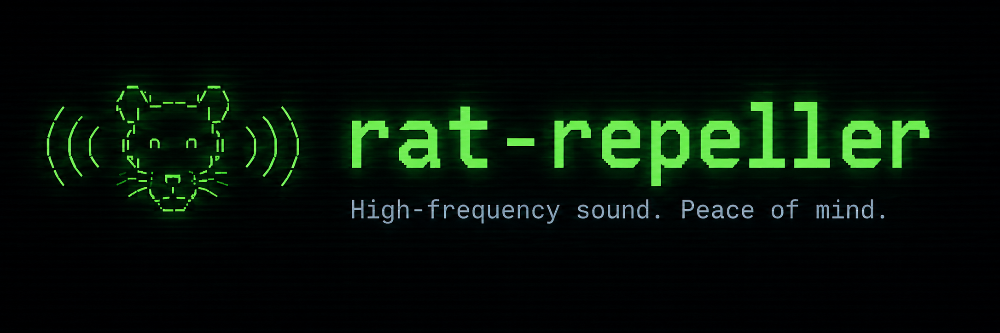

天井裏から物音が聞こえたので、反射的に開発着手した。

高周波音を鳴らし続けてネズミを撃退するTUIアプリ。ターミナル上でON/OFFと周波数を操作する。

## 技術的な注意
- 市販のネズミ撃退器は概ね20kHz〜65kHzの超音波を使う。一般的なPC内蔵スピーカーは20kHz前後が再生上限で、16〜18kHz付近から出力が急減衰する機種が多い。内蔵スピーカーのままでは十分な音圧が出ない可能性が高く、効果を狙うなら高域再生に対応した外部スピーカー/ツイーターが必要になる。
- 18〜20kHz付近は人によって聞こえ、不快感を伴う場合がある。ペット(犬・猫)にはより高い周波数まで聞こえる。

## 使い方
```
cargo run --release
```

- `Space`: ON/OFF切替
- `w`: 波形切替(Sine→Square→Sawtooth→Triangle→Sineと循環)
- `s`: スイープモード切替(中心周波数を軸に周波数自体を揺らす。慣れ防止用。数学的には周波数変調)
- `↑` / `↓`: 周波数を10Hz単位で調整
- `Shift+↑` / `Shift+↓`: 周波数を1000Hz単位で調整
- `←` / `→`: スイープ速度を0.05Hz単位で調整(0.05Hz〜100Hz、初期値0.3Hz)
- `Shift+←` / `Shift+→`: スイープ速度を1Hz単位で調整
- `[` / `]`: スイープ範囲(周波数偏移)を10Hz単位で調整(100Hz〜5000Hz、初期値1000Hz)
- `a` / `d`: スイープの上昇比率を5%単位で調整(5%〜95%、初期値50%=対称。上げを長く/下げを短く、のような非対称な揺れ方にできる)
- `q` / `Ctrl-C`: 終了

画面には中心周波数と現在の瞬時周波数(スイープ中は変動する)を数値表示し、瞬時周波数の推移をスクロールグラフでも表示する(OFF中はグラフを進めず、直前までの推移をそのまま保持する)。

`q` / `Ctrl-C`で終了すると、その時点の全設定とグラフの推移を`~/.config/rat-repeller/state.json`相当のパスに保存し、次回起動時に復元する。

周波数の上限は起動時にデバイスが対応する最大サンプルレートを自動選択して決まる(48kHz構成なら24kHz弱、96kHz対応デバイスなら48kHz弱まで)。それ以上の値はエイリアシングして音にならないため設定できない。

起動直後、ロゴをハーフブロック文字(`▀`)によるピクセルアートでスプラッシュ表示する(2秒経過、または何らかのキー入力で閉じる)。Sixel/Kitty/iTerm2等の画像プロトコルには依存せず、truecolor対応ターミナルであれば表示できる。

## テスト
```
cargo test
```

## 設計
[docs/spec.md](docs/spec.md) 参照。
