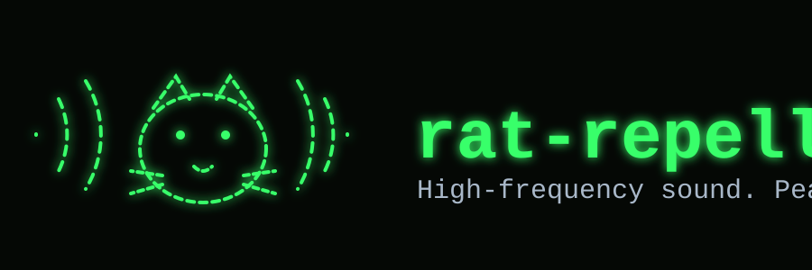

天井裏から物音が聞こえたので、反射的に開発着手した。

高周波音を鳴らし続けてネズミを撃退するTUIアプリ。ターミナル上でON/OFFと周波数を操作する。

## 技術的な注意
- 市販のネズミ撃退器は概ね20kHz〜65kHzの超音波を使う。一般的なPC内蔵スピーカーは20kHz前後が再生上限で、16〜18kHz付近から出力が急減衰する機種が多い。内蔵スピーカーのままでは十分な音圧が出ない可能性が高く、効果を狙うなら高域再生に対応した外部スピーカー/ツイーターが必要になる。
- 18〜20kHz付近は人によって聞こえ、不快感を伴う場合がある。ペット(犬・猫)にはより高い周波数まで聞こえる。

## 使い方
```
cargo run --release
```

- `Space`: ON/OFF切替
- `w`: 波形切替(Sine→Square→Sawtooth→Triangle→Sineと循環)
- `s`: スイープモード切替(中心周波数を軸に周波数自体を正弦波状に揺らす。慣れ防止用。数学的には正弦波周波数変調)
- `↑` / `↓`: 周波数を10Hz単位で調整
- `Shift+↑` / `Shift+↓`: 周波数を1000Hz単位で調整
- `←` / `→`: スイープ速度を0.05Hz単位で調整(0.05Hz〜3.0Hz、初期値0.3Hz)
- `PageUp` / `PageDown`: スイープ範囲(周波数偏移)を100Hz単位で調整(100Hz〜5000Hz、初期値1000Hz)
- `q` / `Ctrl-C`: 終了

画面には中心周波数と現在の瞬時周波数(スイープ中は変動する)を数値表示し、瞬時周波数の推移をスクロールグラフでも表示する。

周波数の上限は起動時にデバイスが対応する最大サンプルレートを自動選択して決まる(48kHz構成なら24kHz弱、96kHz対応デバイスなら48kHz弱まで)。それ以上の値はエイリアシングして音にならないため設定できない。

対応端末(iTerm2/kitty/WezTerm等のSixel・Kitty・iTerm2画像プロトコル対応ターミナル)では起動画面にロゴ画像を表示する。非対応の端末ではテキストタイトルにフォールバックする。

## テスト
```
cargo test
```

## 設計
[docs/spec.md](docs/spec.md) 参照。
